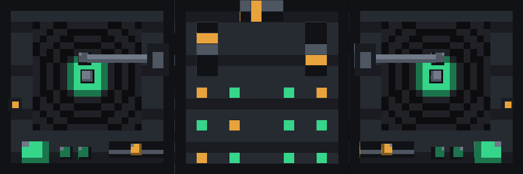

# DJPult — Resourcepack

Das komplette Pack für das dreiteilige DJ-Pult: Mixer in der Mitte, Plattenspieler links und
rechts. Modelle **und** Texturen sind fertig, du kannst es direkt einpacken und laden.



```
resourcepack/
├── pack.mcmeta
├── build_assets.py                    erzeugt Modelle + Texturen neu
└── assets/djpult/
    ├── items/                         Item-Definitionen
    │   ├── dj_pult_links.json
    │   ├── dj_pult_mitte.json
    │   └── dj_pult_rechts.json
    ├── models/item/
    │   ├── dj_pult_links.json         Plattenspieler links
    │   ├── dj_pult_mitte.json         dein Mixer, korrigiert
    │   └── dj_pult_rechts.json        Plattenspieler rechts, gespiegelt
    └── textures/item/
        ├── dj_pult_mitte.png          Textur des Mixers
        └── dj_pult_seite.png          Textur beider Plattenspieler
```

## Einbauen

1. Den Ordner `resourcepack/` als ZIP packen — `pack.mcmeta` muss **auf oberster Ebene** im ZIP
   liegen, nicht in einem Unterordner — und nach `.minecraft/resourcepacks/` legen.
2. In `plugins/DJPult/config.yml` eintragen:

```yaml
model:
  parts:
    - item-model: "djpult:dj_pult_links"
      right: -1.0
    - item-model: "djpult:dj_pult_mitte"
      right: 0.0
    - item-model: "djpult:dj_pult_rechts"
      right: 1.0
```

3. `/djpult reload`

**Hast du schon eine eigene `dj_pult_mitte.png`?** Dann überschreib die hier einfach damit — dein
Mixer-Modell benutzt genau die UV-Bereiche, für die deine Textur gemalt ist.

## Die Modelle

**Mitte** ist dein Mixer, mit zwei Korrekturen:

* Das doppelte Element auf `[5,2,11] → [6,3,12]` ist raus — zwei identische Würfel an derselben
  Stelle flackern gegeneinander. 20 → 19 Elemente, dein Knopfraster ist vollständig geblieben.
* Der Texturpfad heißt jetzt `djpult:item/dj_pult_mitte` statt `dj_pult_mitte`; ohne Namespace
  hätte Minecraft unter `assets/minecraft/textures/` gesucht.

**Links und rechts** sind Plattenspieler: Grundplatte (identisch zur Mitte, damit die Reihe bündig
ist), zweistufiger Plattenteller, Spindel, Tonarm mit Lager und Tonabnehmer, Pitch-Fader mit
Regler, Start/Stop und zwei kleine Tasten. Rechts ist die exakte Spiegelung von links, der Tonarm
sitzt dort auf der anderen Seite — wie bei einem echten Battle-Aufbau.

Alle drei Modelle sind darauf geprüft, dass keine zwei gleich ausgerichteten Flächen aufeinander
liegen, es flackert also nichts.

## Die Texturen

Beide sind 32×32, dunkles Gehäuse mit grünem Akzent und ein paar bernsteinfarbenen Reglern.

`dj_pult_seite.png` ist in Bereiche aufgeteilt: Deckfläche, Schallplatte (Rillen nach Radius,
farbiges Label, Spindelloch), Gehäuseseiten, Tellerkanten, Tonarm und je eine Kachel für Lager,
Tonabnehmer, Spindel, Fader-Schlitz, Pitch-Regler und die Tasten. Der obere Tellerschritt greift
den inneren Ausschnitt derselben Schallplatte ab, damit die Rillen über die Stufe hinweg
weiterlaufen statt neu anzufangen.

`dj_pult_mitte.png` ist aus deinem Modell heraus gemalt: Das Skript liest jede Fläche und färbt
genau deren UV-Rechteck ein — Deckfläche, Gehäuseseiten, Fader-Schlitze und Knopfkappen im
Wechsel grün und bernstein. Deshalb sitzt jede Farbe garantiert dort, wo dein Modell sie abgreift.

## Ändern

Die Modelle lassen sich direkt in Blockbench öffnen (`File → Open Model`) und speichern im selben
Format zurück.

Die Texturen kannst du natürlich einfach übermalen. Wenn du stattdessen die Farben ändern willst,
stehen sie oben in `build_assets.py` als Palette; danach:

```bash
python3 build_assets.py            # ohne Argument: nur Seitenteile + Textur
```

Das Skript prüft dabei auch, dass sich keine zwei Atlas-Bereiche überlappen und kein Modell
flackernde Flächen hat. Es braucht nur die Python-Standardbibliothek.

`pack.mcmeta` steht auf Format 84 (Minecraft 26.1). Falls dein Server eine andere Version fährt,
die Zahl mit <https://misode.github.io/pack-mcmeta/> gegenprüfen.
